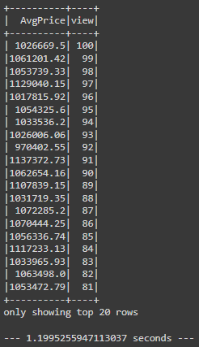
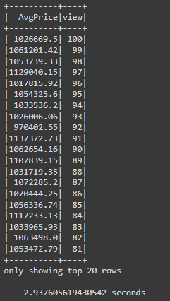
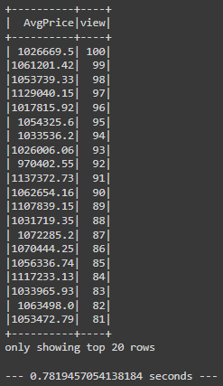

# home_sales
Module 22 Challenge

### Objective
Use SparkSQL to read in and query the provided CSV on home sales. Cache, partition, and parquet the dataframe and rerun a certain query with a run-time timer and compare the results.

### Analysis
* Using PySpark, the provided data was read in and transformed into a dataframe.
* I also imported the date time function from pyspark.sql to pull the year from the 'date' column, which refers to the date the house was sold. I added this column as 'year_sold' to the original dataframe.
* Using SQL functions `SELECT`, `FROM`, `WHERE`, `GROUP BY`, AND `ORDER BY...DESC` to query the data and find average prices by year sold, number of bedrooms, number of bathrooms, date built, number of views, square footage.
  * Average prices were found using the `AVG()` function, and rounded to two decimal places using `ROUND([column and/or calculation], 2).
  * The last query was to find the average home price per view rating, where the average home price was >= $350,000 and the results were in descending order by view rating. This query was timed and reused later in the challenge.

    
* The next task was to cache the temporary table 'home_sales' and rerun the last query (avg prices by views) with a run time. The time for the cached query to run is 2.94 seconds, where the uncached query took 1.20 seconds.
  

* The last task was to partition the dataframe by the 'date_built' column and use a parquet format. Once this was accomplished a new temporary view was created called 'home_sales_partitioned'.
* Within this view, the timed query from the uncached and cached data was ran and re-timed.
* The partioned query took 0.78 seconds to run, versus the 2.94 seconds for the cached query. This is because similar data is grouped together and only the data pertinent to the query is evaluated.

# Resources
* Module 22 activities
* Xpert Learning Assistant
* https://datavalley.ai/demystifying-spark-sql-you-must-know-partition/#:~:text=By%20grouping%20similar%20data%20together,to%20faster%20query%20processing%20times.

A temporary table of the parquet data is created. (10 points)

The query from step 6 is run on the parquet temporary table, and the run time is computed. (10 points)

The "home_sales" temporary table is uncached and verified.
